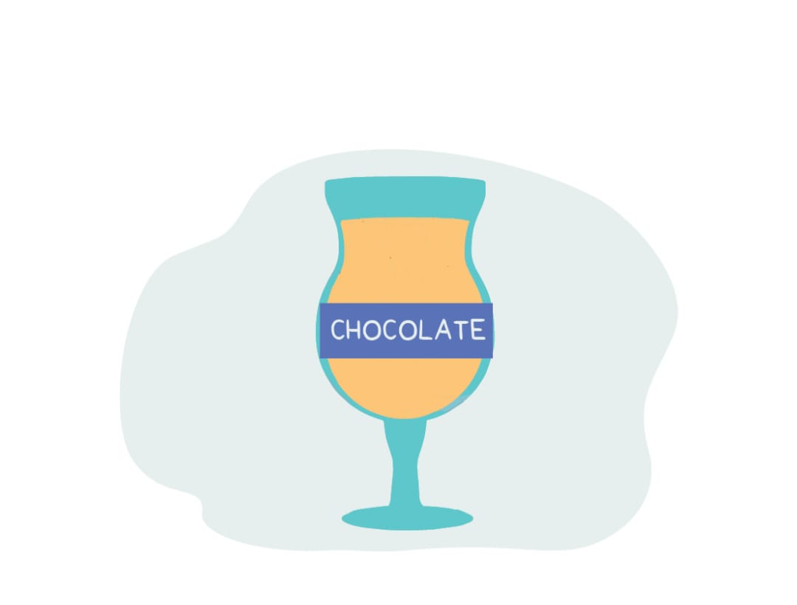

# Variable

In programming , we need to store and work with various kind of data.

The data is stored in memory, and when we want to 'lablel'  it as a peice of information  we call it a variable.
The data can be fetched and manipulated at any particular instance in the program.

`A  variable is a symbolic name that is a reference or points to an object/value. Once an object/value is assigned to a variable, you can refer to the object/value by that name.`

**A Simple Analogy**
- Think of a glass container, that you might use to store chocolates, lets put a sticker on it as ' chocolates'
- Here , the `glass container is just like a memory space` in your computer used to store data.
- `Chocolates are the data stored in it`.
- And the label `Chocolates is the name given to that memory space` ,which is a variable.

  
---
## Creating a variable in python
- Declare a lable to the memory location, which is called variable name
- Assign the value using equal sign (=) which is also called assignment operator.
- Give the required value i.e data we want to store in that variable.

**`variable-name = value`** 

---
## Variable Assignment

In Python, variables need not be declared or defined in advance, as is the case in many other programming languages. To create a variable, we just assign it a value and then start using it. Assignment is done with a single equals sign (=):

Lets say we want to save our name in a variable :

```python
name = "john"
print(name)
```
`output : john` 

>>In above example 'name' is a variable and 'john' is data / value we want to store in memory 

Later, if we change the value of variable and use it again, the new value will be substituted instead:

```python
name = "john" 
print(name)
name = "fabian"
print (name)
```

**output :**

`john` 

`fabian`
___
- ## Chain Assignment
Python also allows chained assignment, which makes it possible to assign the same value to several variables simultaneously :

```python
x=y=z=20
print(x,y,z)
```
`output : 20 20 20 `

- ## Multiple Assignment
We can also assign different values to multiple variables in chained fashion.

```python
x,y,z=10,20,30
print(x,y,z)
```
`output : 10 20 30`

---

## Variable type in python

- In many programming languages, variables are statically typed. That means a variable is initially declared to have a specific data type, and any value assigned to it during its lifetime must always have that type.
  
- Variables in Python are not subject to this restriction. In Python, a variable may be assigned a value of one type and then later re-assigned a value of a different type:

**Example**
```python
var = 20
print(var)
print(type(var))
var="now im changed to string"
print(var)
print(type(var))
```
**Output**

- `20`
- `<class 'int'>`
- `now im changed to string`
- `<class 'str'>`

---
## Variable names in python
- Officially, variable names in Python can be any length and can consist of uppercase and lowercase letters (A-Z, a-z), digits (0-9), and the underscore character (_).

>### Rules for Python variables :


**1. A variable name must start with a letter or the underscore character.**
   
*Example :*
```python
name="tejender"
_name="john"
print(name,_name)
```
*Output :* 
- `tejender john`   

**2. A variable name cannot start with a number.**
   
*Example :*
```python
4age=20
print(4age)
```
*Output :*
- `line 1
    4age=20
     ^
SyntaxError: invalid syntax
`

**3. A variable name can only contain alpha-numeric characters and underscores (A-z, 0-9, and _ ).**

*Example :*
```python
my_name="tejender"
print(my_name)
my_name123 = "john"
print(my_name123)
```
*Output :*
- `tejender`
- `john`

**4. Variable names are case-sensitive (age, Age and AGE are three different variables).**

*Example :*

```python
age=20
Age=30
AGE=40
print(age,Age,AGE)
```
*Output :*
- `20 30 40`


>>**Tip :** *There is nothing out of the syntax /rule while creating two different variables in the same program called age and Age, or for that matter agE. But it is probably ill-advised / not recomended . Because It would certainly confuse anyone trying to read your code, and even you yourself, after you’d been away from it awhile.
It is worthwhile to give a variable a name that is descriptive enough to make clear what it is being used for.*

---
## The most commonly used methods of constructing a multi-word variable name are as follows :

**1. Camel Case** : Second and subsequent words are capitalized, to make word boundaries easier to see. (Presumably, it struck someone at some point that the capital letters strewn throughout the variable name vaguely resemble camel humps.)

*Example :*
```python
collageName="MIT"
```
**2. Pascal Case** : Identical to Camel Case, except the first word is also capitalized.
.

*Example :*
```python
CollageName="MIT"
```
**3. Snake Case** : Words are separated by underscores.

*Example :*
```python
collage_name="MIT"
```
---
## Reserved Words (Keywords)

There is one more restriction on identifier names. The Python language reserves a small set of keywords that designate special language functionality. No object can have the same name as a reserved word.

In Python 3.6, there are 33 reserved keywords. These are:

>> `False` , `def` , `if`, `raise`, `None`, `del`, `import`, `return`, `True`, `elif`, `in`, `try`, `and`, `else`, `is`, `while`,`as`,`except`, `lambda`, `with`, `assert`, `finally`, `nonlocal`, `yield`, `break`, `for`, `not`, `class`, `from`, `or`, `continue`, `global`, `pass`.

   
  

    
