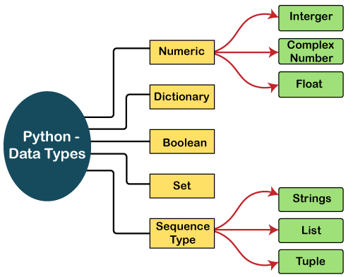

# Data Types

A variable is use to store any type of datathat is required by the program.

`The data can be a word , a number , a decimal etc`

*Examle :*
```python
name = "john doe"
age =40
height = 6.3
```
Here we can see there are three variables, name, age , and height with their repective
values.But all these variables hold differenttypes of value.

This brings the concept of data types in python, for that matter or any other programming language.

In simpler term, Data types are the classification or categorization of data items.

Python provides various types of data to work with.which are:


1. Numeric Type
2. Sequence Type
3. Boolean
4. Sets
5. Mapping Type (Dictionary)


